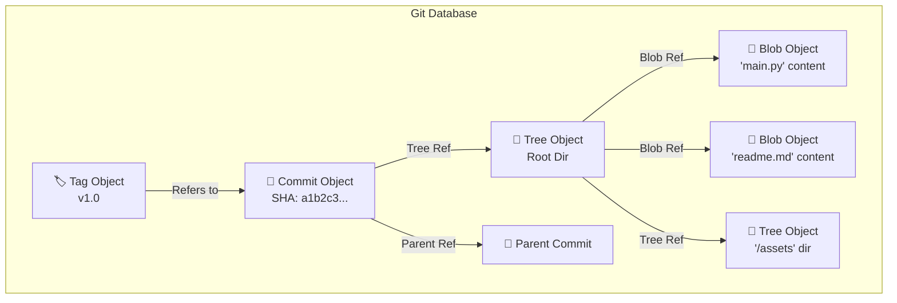

---
tags:
  - 🐙git/objects
  - 🐙git/theory
  - 🐙git
💠Stack: 🐙 Git
🌍 Scope:
  - 🌎 Global
🛡️ Risk: ✅ Safe
📝 Description: "Внутреннее устройство Git. Объектная модель хранения данных: Blob, Tree, Commit и Tag. Папка .git/objects."
💻 Command:
  - git cat-file -p <hash>
  - git ls-tree <tree-ish>
---
# 🐙 Глава: Git Data Model (Объекты)
*Under the Hood: Как Git хранит данные*

> [!ABSTRACT]+ 🗄️ Принцип хранения (Content-Addressable Filesystem)
> Git — это не просто VCS, это **контентно-адресуемая файловая система**.
> * **Где хранится:** Все объекты живут в папке `.git/objects`.
> * **Как ищется:** Ключом является **SHA-1 хэш** (40 символов).
> * **Иммутабельность:** Даже если файл переименовывается или перемещается, его содержимое остаётся неизменным, и его хэш сохраняется прежним.

---

## 1. 📄 BLOB (Binary Large Object)
*Чистый контент*

Любые файлы любых типов хранятся в виде blob-объектов

* **Суть:** Хранит **содержимое** файла.
* **Особенность:** Blob **НЕ знает** имени файла и его прав доступа. Это просто массив байт.
* **Создание:** Создается в момент добавления файла в индекс (`git add`).
* **Дедупликация:** Если у вас в проекте два файла с одинаковым содержимым (в разных папках), Git сохранит только **один** blob.

> [!EXAMPLE] Аналогия
> Распечатанный лист бумаги с текстом, но без подписи и без папки.

---

## 2. 🌳 TREE (Дерево)
*Структура и Имена*

Это объект, который содержит структуру файлов и директорий. 

* **Суть:** Хранит структуру файлов и директорий.
* **Содержимое:** Список, связывающий:
    * Имена файлов.
    * Права доступа (например, `100644` для обычного файла или `040000` для папки).
    * Ссылки (SHA-1) на соответствующие **Blob**-объекты или другие **Tree** (подпапки).
* **Создание:** Создается при создании коммита. Команда `git commit` берет текущее состояние индекса (Staging Area), создает объект Tree и связывает его с коммитом.

---

## 3. 💾 COMMIT (Коммит)
*Снимок состояния*

Это объект, который фиксирует определённое состояние репозитория.

* **Суть:** Фиксирует определенное состояние репозитория (Snapshot).
* **Содержимое:**
    * Ссылка на **Root Tree** (корневое дерево проекта в этот момент).
    * **Метаданные:** Имя автора, email, дата, сообщение коммита.
    * **Parent:** Ссылка на SHA-1 **предыдущего** коммита (именно так строится история/цепочка).
* **Создание:** Генерируется командой `git commit`.

---

## 4. 🏷️ TAG (Аннотированный тег)
*Вечная метка*

Объект, указывающий на конкретный коммит.

* **Суть:** Неизменяемая метка на определенный момент истории (обычно релиз).
* **Типы тегов:**
    1.  **Lightweight (Легковесный):** Это **НЕ** объект. Это просто файл-указатель (как ветка), хранящийся в `.git/refs/tags`. Создается через `git tag <name>`.
    2.  **Annotated (Аннотированный):** Полноценный **объект** в базе Git.

### Создание аннотированных тегов:

| Команда      | Описание                                                                                                                           |
| :----------- | :--------------------------------------------------------------------------------------------------------------------------------- |
| `git tag -a` | **Annotated.** Создает объект тега. Позволяет добавить метаданные (кто создал, когда, сообщение). Хранится в `.git/objects`.       |
| `git tag -s` | **Signed.** То же, что и `-a`, но с **цифровой подписью** (GPG). Гарантирует, что тег создал именно этот автор и его не подделали. |

---

## 5. 🧠 Визуализация связей (Mermaid)

Вот как эти объекты ссылаются друг на друга:


## 6. 🕵️ Алгоритм: Как найти и посмотреть объект?

Мы не лезем в папку `.git` руками. Мы используем "сантехнические" (plumbing) команды.

> [!TIP]+ Шаг 1: Найти хэш коммита
> Сначала нам нужно узнать точку входа (SHA-1 коммита), чтобы от неё "раскрутить" дерево.
> ```bash
> git log --oneline -n 1
> # Вывод: a1b2c3d (Initial commit)
> ```
> 👉 *Берем хэш:* `a1b2c3d`

> [!NOTE]+ Шаг 2: Узнать состав коммита (Найти Tree)
> Посмотрим, на какое дерево (Tree) ссылается этот коммит.
> ```bash
> git cat-file -p a1b2c3d
> # Вывод: tree e4f5g6...
> ```
> 👉 *Теперь у нас есть хэш корневого дерева:* `e4f5g6...`

> [!EXAMPLE]+ Шаг 3: Раскрыть дерево (Найти Blob)
> Теперь посмотрим, какие файлы лежат внутри этого дерева.
> ```bash
> git ls-tree e4f5g6...
> # Вывод: 100644 blob 8h9i0j...  readme.md
> ```
> 👉 *Мы нашли хэш конкретного файла (blob):* `8h9i0j...`

> [!SUCCESS]+ Шаг 4: Прочитать контент (Blob)
> Наконец, выводим содержимое файла по его хэшу, не открывая сам файл.
> ```bash
> git cat-file -p 8h9i0j...
> # Вывод: "Hello World in Readme"
> ```

---
## 7. 🛠️ Справочник команд (Plumbing)

Эти команды редко используются в обычной работе, но необходимы для отладки и понимания устройства Git.

| Команда           | Аргументы         | Описание                                                                                                                                                              |
| :---------------- | :---------------- | :-------------------------------------------------------------------------------------------------------------------------------------------------------------------- |
| `git log`         | `--oneline -n 1`  | **"Quick Hash".** Выводит историю в одну строку (`--oneline`) и ограничивает вывод только **последним** коммитом (`-n 1`). Самый быстрый способ узнать текущий SHA-1. |
| `git cat-file`    | `-p <hash>`       | **"Pretty-print".** Самая главная команда. Распознает тип объекта по хэшу и выводит его содержимое в человекочитаемом виде.                                           |
| `git cat-file`    | `-t <hash>`       | **"Type".** Показывает *тип* объекта (blob, tree, commit), который скрывается за хэшем.                                                                               |
| `git ls-tree`     | `<hash>` / `HEAD` | Показывает содержимое объекта **Tree** (как `ls` в Linux). Выводит права доступа, тип, хэш и имя файла.                                                               |
| `git hash-object` | `<file>`          | Вычисляет SHA-1 хэш для файла, *как если бы* он был добавлен в базу Git (но не сохраняет его).                                                                        |

## 8. 🗣️ Deep Dive (Вопросы на собеседовании)

> [!QUESTION]- Если я переименую файл, создастся ли новый Blob?
> **Нет.**
> Git хеширует только **содержимое** файла. Поскольку содержимое (байты текста) не изменилось, SHA-1 блоба остается прежним.
> Изменится только объект **Tree** (дерево), в котором напротив *старого* хеша блоба будет записано *новое* имя файла.

> [!QUESTION]- Почему Git не хранит пустые папки?
> Потому что объект **Tree** (который представляет папку) — это по сути список ссылок на файлы (Blob) или другие папки (Tree).
> Если папка пустая, в ней нет ссылок. Следовательно, Git просто **не может создать** объект Tree для неё, так как ему нечего в него записать.
> *Решение:* Создать скрытый файл `.gitkeep` внутри папки.

> [!QUESTION]- Как посмотреть содержимое объекта вручную?
> Используй "команду-рентген":
> ```bash
> git cat-file -p <SHA-1>
> ```
> Флаг `-p` (pretty-print) покажет понятное содержимое любого объекта, будь то текст файла (blob), список файлов папки (tree) или инфо о коммите.

## 🔗 Связи

- **Работа с историей:** [[Git - git log]]
- **Индекс:** [[Git - Staging Area]]
- **Справочник:** [[Git - Cheat Sheet]]